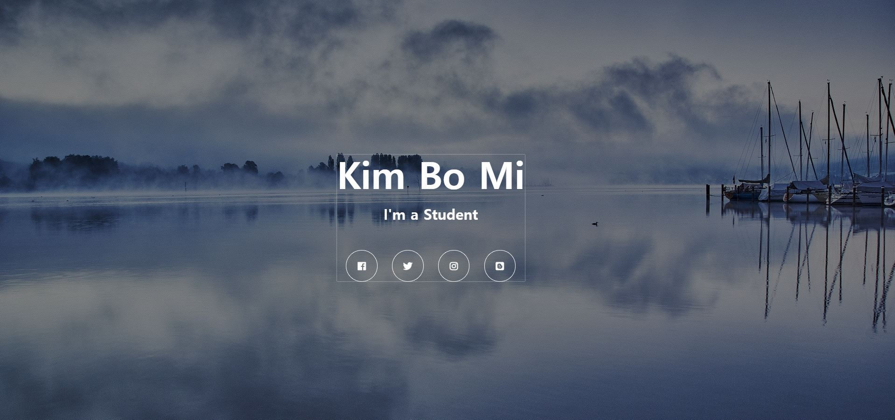
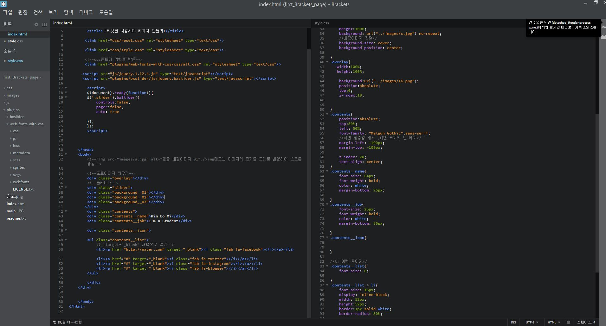

# Brackets_Lecture01

* plugins(제공되는 라이브러리, 모든 파일을 쓰진 않아서 올리지 않음)

  * bxslider -슬라이더

  * web-fonts-fontawesome -아이콘

### 느낀점
- 브리켓으로 바로 화면을 볼수 있고, 좌우 분할로 html파일과 css파일을 함께 사용하니 편리했다.
- 마지막 contents 중앙 정렬시 일단 화면 크기의 반을 margin 값에서 빼줌으로서 정렬이된다고 했는데 잘 안돼서 아쉬웠다.
- chrome의 개발자 도구를 통해 오류 내용을 확인하고 폰트나 화면 크기같은 내용을 찾아 볼 수 있었다.

[강의 링크](https://www.inflearn.com/course/html-css-sucademy/dashboard)
